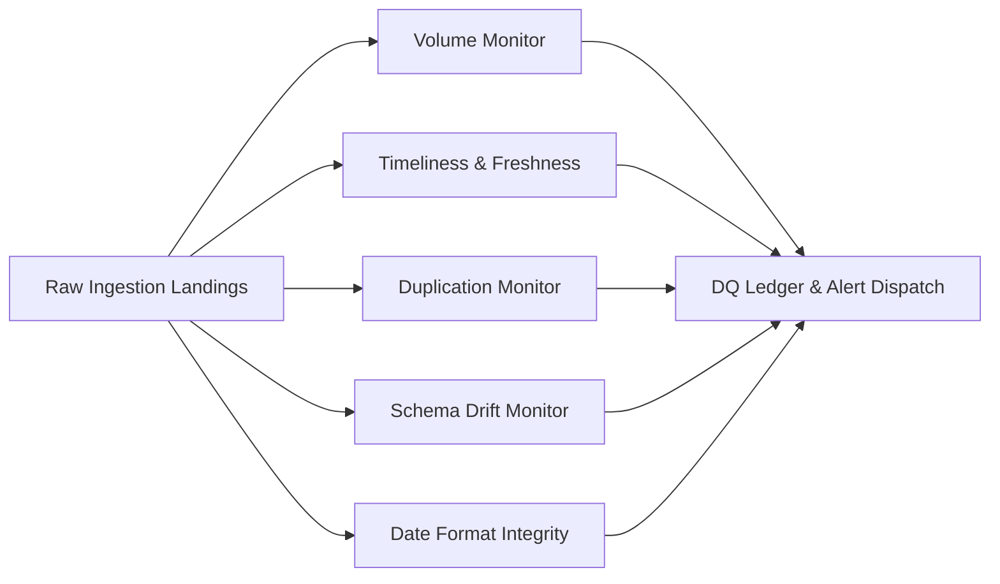

Data quality is a first-class citizen in **toorow**. Every ingestion pull executed across built-in connectors or managed file feeds undergoes automated surveillance before metrics are exposed to semantic marts and AI agents.

---

## 1. The 5 Universal Data Quality Monitors

Implemented in `server/core/dq_monitors.py`, these five monitors run automatically after every ingestion cycle:

### Admin Console: Quality Dashboard

### 1. Volume Anomaly Monitor (`volume`)
Detects unexpected drops or spikes in ingested row counts compared to historical trailing averages.
- **Baseline Window**: 30-day trailing mean and standard deviation.
- **Threshold**: Triggers warning when `|z-score| >= 3.0` and error when `|z-score| >= 5.0`.
- **Use Case**: Catches silent API source failures where an API returns `HTTP 200 OK` with an empty data array.

### 2. Timeliness & Freshness Monitor (`timeliness`)
Monitors the delta between the maximum date/timestamp present in the ingested data and the execution time.
- **Max Delay Threshold**: Configurable per connector (default: 24 hours for daily APIs).
- **Alert Action**: Flags datastreams as `stale` or `delayed` in the Admin Console and morning briefing ledger.

### 3. Duplication Monitor (`duplication`)
Verifies joint-grain uniqueness across raw landing rows prior to staging transformation.
- **Check Condition**: Identifies rows sharing identical `(project_id, date, metric, breakdown_dimension, breakdown_value)`.
- **Resolution**: While staging dbt models automatically deduplicate via `QUALIFY ROW_NUMBER() OVER (PARTITION BY grain ORDER BY pull_id DESC) = 1`, the monitor logs duplicate ingestion instances for pipeline auditing.

### 4. Schema Drift Monitor (`schema_drift`)
Detects unexpected changes in upstream source field types, missing expected columns, or newly introduced unmapped columns.
- **Behavior**: Compares incoming payload field structures against the authoritative manifest descriptor (`manifest.json`).
- **Safety Action**: Unmapped columns are safely landed in raw JSON storage without breaking downstream staging queries.

### 5. Date Format & Grain Integrity Monitor (`date_format`)
Validates date string formatting, ISO compliance, and temporal consistency.
- **Check Condition**: Ensures dates conform strictly to `YYYY-MM-DD` and timestamps match ISO 8601 extended standards.
- **Grain Validation**: Verifies that daily reports do not contain intraday timestamps without explicit grain declaration.

---

## 2. Data Quality REST APIs

Administrators and automated pipelines can inspect DQ status via dedicated REST endpoints (`server/core/dq_api.py`):

| Endpoint | Method | Description |
|---|---|---|
| `/api/dq/status` | `GET` | Overall data quality health score across all datastreams. |
| `/api/dq/monitors/runs` | `GET` | Historical log of DQ monitor executions and findings. |
| `/api/dq/alerts` | `GET` | List active open data quality alerts and anomalies. |

---

## Next Steps & Cross-References

<CardGroup cols={2}>
  <Card title="Anomaly Detection" icon="chart-line" href="/anomaly-detection-method">
    Review z-score calculations for performance metric anomalies.
  </Card>
  <Card title="Semantic Layer" icon="layer-group" href="/semantic-layer">
    See how validated data feeds canonical `fact_daily_kpi` marts.
  </Card>
</CardGroup>
