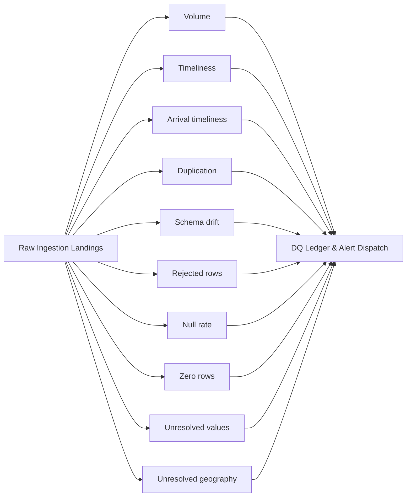

Every pull — from a connector or from a managed file feed — is checked before its rows reach a mart or an agent. Ten monitors run after each ingestion cycle; each one names what it saw and the gesture that repairs it, never a status code.

---

## 1. The 10 Universal Data Quality Monitors

Implemented in `server/core/dq_monitors.py` and registered in
`server/core/dq_monitor_registry.py`, these monitors run automatically after
every ingestion cycle. Nine watch one Datastream each; one watches the project.

### 1. Volume (`volume`)
Detects unexpected drops or spikes in ingested row counts compared to historical trailing averages.
- **Baseline Window**: 30-day trailing mean and standard deviation.
- **Use Case**: Catches silent API source failures where an API returns `HTTP 200 OK` with an empty data array.

### 2. Timeliness (`timeliness`)
Monitors the delta between the maximum date/timestamp present in the ingested data and the execution time.
- **Max Delay Threshold**: Configurable per connector (default: 24 hours for daily APIs).
- **Alert Action**: Flags datastreams as `stale` or `delayed` in the console.

### 3. Arrival timeliness (`arrival_timeliness`)
The timeliness question asked the other way round, for a feed that **arrives**
instead of being pulled — an emailed file, a dropped export. It watches the
deadline the feed was promised to meet, not the age of the newest row.

### 4. Duplication (`duplication`)
Verifies joint-grain uniqueness across raw landing rows prior to staging transformation.
- **Check Condition**: Identifies rows sharing the declared grain.
- **Resolution**: Staging models deduplicate via `QUALIFY ROW_NUMBER() OVER (PARTITION BY grain ORDER BY pull_id DESC) = 1`; the monitor logs the duplicate landings so the pipeline can be audited.

### 5. Schema drift (`schema`)
Detects unexpected changes in upstream source field types, missing expected columns, or newly introduced unmapped columns.
- **Behavior**: Compares incoming payload field structures against the authoritative manifest descriptor (`manifest.json`).
- **Safety Action**: Unmapped columns land in raw JSON storage without breaking downstream staging queries.

### 6. Rejected rows (`date_format`)
Validates date string formatting, ISO compliance, and temporal consistency, and
names the rows that were rejected for it.
- **Check Condition**: Dates conform to `YYYY-MM-DD`, timestamps to ISO 8601 extended.
- **Grain Validation**: Daily reports may not carry intraday timestamps without an explicit grain declaration.

### 7. Null rate (`null_rate`)
The share of a **required** field that arrived empty. Required means: a member of
the active mapping version's declared grain — a list a person chose — and nothing
else. What is judged is the *missing* rate, `NULL` **or** blank, because a landed
empty string is just as absent as a null and was measured as the more common
spelling of the two. A mapping version with an empty grain answers
`not_applicable` rather than inventing a rule.

### 8. Zero rows (`zero_rows`)
Did this Datastream's window return nothing, where the source has been producing?
Distinguished from the volume monitor: zero is not a small number, it is an
absence, and it has its own repair.

### 9. Unresolved values (`unresolved_values`)
After mapping, which values does the reading still fail to name — a video grouped
under nothing, a placement no plan line covers? It fires per
`(datastream, dimension, reason)`, and it remembers what it has already announced
by fingerprint, never by value: the backlog present when the monitor is armed
becomes the baseline and is not posted, so the alert you get is a *new* gap.

### 10. Unresolved geography (`geography`)
Project-scoped, and evaluated only on a Local-markets project: a Global project
makes no geographic promise, so an unmapped country value is not a gap against
anything it published.

---

## 2. Reading the findings

An agent reads quality over MCP: `get_data_quality_report(project_id, connector)`
returns the state of the ten monitors, and every Result carries the findings that
applied to the data behind it.

The console reads and governs the rules through the project-scoped REST family
`/api/projects/{project_id}/governance/controls-quality/…` — change sets, rule-set
versions, adoption, and a `dq-monitors/{monitor_id}/evaluations` call that runs
one monitor now instead of waiting for the night. See the
[API Reference](/api-reference).

<Note>
  This page used to list `/api/dq/status`, `/api/dq/monitors/runs` and
  `/api/dq/alerts`. None of the three has ever existed. Measured 2026-09-06: the
  composed router mounts 547 addresses and not one of them begins with
  `/api/dq`.
</Note>

---

## Next Steps & Cross-References

<CardGroup cols={2}>
  <Card title="Anomaly Detection" icon="chart-line" href="/anomaly-detection-method">
    Review z-score calculations for performance metric anomalies.
  </Card>
  <Card title="Semantic Layer" icon="layer-group" href="/semantic-layer">
    See how validated data feeds canonical `fact_daily_kpi` marts.
  </Card>
</CardGroup>
