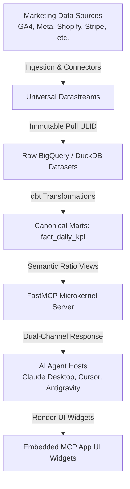

**toorow** is a self-hostable marketing data platform engineered for artificial intelligence agents. It leverages the **Model Context Protocol (MCP)** to grant agents governed access to unified marketing indicators without exposing raw credentials, provider APIs, or underlying database tables.

---

## High-Level Architecture

---

## Key Capabilities

- **37+ Pre-Built Connectors**: Metrics from GA4, Search Console, Meta Ads, TikTok Ads, LinkedIn Ads, Shopify, Stripe, and Klaviyo converge into a canonical semantic model built with dbt.
- **Audited & Traceable Analysis**: Freshness, data provenance, quality checks (DQ baselines), and alerts accompany every metric served to AI agents.
- **Isolated Multi-Tenant Access**: Inbound identity, provider OAuth scopes, and dataset access are strictly isolated per project (AD-5 resource graph).
- **Dual-Channel Response Model**: Agents receive a short, contextual text summary while the accompanying MCP widget receives a rich, structured data payload (`structuredContent`) for rendering visual cards.
- **Extensible Module Architecture**: Connectors are self-contained modules auto-discovered at boot, featuring manifests, staging SQL, dbt marts, and golden-pull conformance tests.

---

## Strategic Direction

toorow is designed as a sovereign control plane for agentic analytics rather than a basic connector catalog:

1. Managed or external warehouse ingestion.
2. Semantic governance and MDM dictionary enforcement.
3. Mandatory data quality and lineage tracking.
4. Shared business context and progressive disclosure.
5. Post-click attribution without proprietary tracking pixels.
6. Continuous evaluation loop for agent reliability.

---

## Explore the Documentation

<CardGroup cols={2}>
  <Card title="Supported Connectors" icon="grid-2" href="/supported-connectors">
    Browse all 37 pre-built connector modules available in toorow.
  </Card>
  <Card title="MCP Host Integration" icon="network-wired" href="/mcp-host-integration">
    Connect Claude Desktop, Cursor, or custom AI agents via FastMCP HTTP.
  </Card>
  <Card title="FastMCP Agent Tools" icon="wrench" href="/agent-tools">
    Inspect FastMCP tool definitions and parameter schemas.
  </Card>
  <Card title="Quickstart Guide" icon="rocket" href="/quickstart">
    Install and run toorow locally in under 5 minutes.
  </Card>
</CardGroup>
