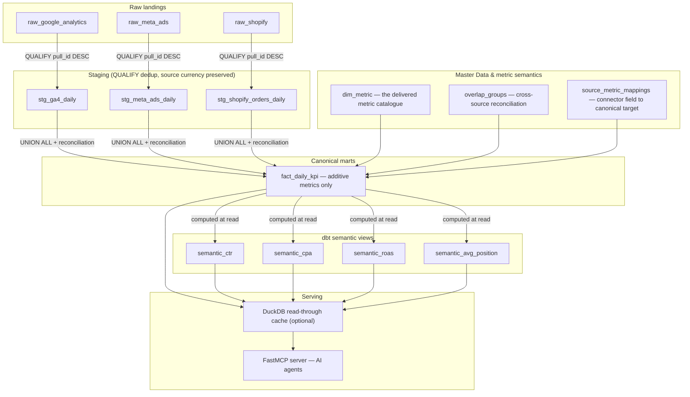

The **Semantic Layer** is where raw ingestion becomes a number someone can defend. It carries the vocabulary a column may be bound to, the rules that decide what happens when two sources report the same thing, and the boundary between what is stored and what is computed.

<Note>
This page was rewritten on 2026-08-15 against the code. The previous version described a system that does not exist here: it called `mdm_*` "Metric Data Master" (it is **Master Data**), named a canonical metric `spend` (it is `cost`), and credited a live Frankfurter FX API that nothing in the server calls. If you read it before that date, re-read the two sections below.
</Note>

---

## Data lineage

---

## 1. The vocabulary a column binds to

**MDM here means Master Data**, not "metric data". Three things carry meaning, and they are not interchangeable:

- **Canonical Field** (`app.mdm_canonical_fields`) — a name, a kind (`metric` or `dimension`), a value type, and an aggregation or an explicit non-additivity. It is the closed enumeration every mapped column is validated against. It carries no formula.
- **Common key** (`app.mdm_common_keys`) — an ordered, immutable, versioned list of canonical *dimensions* shared by several Datastreams. `Day + Campaign` says two sources speak about the same day and the same campaign. It does **not** say one row of one meets one row of the other — that sentence belongs to a Semantic View relationship, and only a relationship pinning an exact key version is executable.
- **Semantic Concept** (`app.semantic_concepts`) — a governed, versioned business definition carrying an expression and an additivity class.

`dbt/seeds/dim_metric.csv` is the delivered metric catalogue that the warehouse reads: name, additive flag, aggregation rule, and — for ratios — the numerator and denominator. `source_metric_mappings` bridges a connector's physical field to a canonical target; `overlap_groups` declares what happens when two connectors report the same one.

---

## 2. Multi-source reconciliation

When several connectors emit the same metric, the overlap is resolved by a declared rule, never by a default:

| Method | What it does | Typical use |
|---|---|---|
| `PRIORITY` | The highest-priority source wins, falling back down the list. | One source is authoritative for the fact. |
| `SUM` | Adds across sources. | Sources are additive and non-overlapping. |
| `DEDUP_ID` | Deduplicates on a shared event id. | The same events arrive twice. |
| `KEEP_SEPARATE` | No merge; each source keeps its own number. | Media cost per platform. |

Resolution is scoped **PROJECT over ORG over PLATFORM**. Without a rule, summing across sources stays refused — the absence of a declaration is never read as permission.

---

## 3. Money: the source currency is preserved, conversion happens once, at read

This is the section the old page got wrong in a way that matters.

- **Staging preserves the amount as the source reported it**, beside the currency it was reported in (`cost_source_value`, `cost_source_currency`). No conversion happens there, so a target-currency change never requires re-ingesting anything.
- **Conversion happens once, at read**, and it carries its provenance: the rate, the date the rate was **quoted**, and the source of that rate.
- **Rates come from a seeded table** (`dbt/seeds/fx_rates.csv`, tagged `fx_source = 'seed'`, `fx_tier = 'fixed'`) — not from a live currency API. Refreshing them is a deliberate build step someone reviews. A currency with no rate leaves the converted value `NULL` and a gap code saying why, rather than letting a source-currency amount be summed into a total that means nothing.
- **A cross-currency total is refused, not guessed.** A sum mixing currencies without a conversion returns a named refusal with the repair, and a contribution whose currency the governed vocabulary does not carry is an explicit gap.
- **Currencies come from one governed ISO 4217 vocabulary** (156 selectable tender currencies), served to every selector by `/api/reference/currencies`. It carries each currency's minor unit, so rounding is data rather than a guess.

---

## 4. Geography

A market is defined by the customer's business scope, not by a connector's default or by a language. Geography rolls up to `country` (ISO 3166-1), and a **market** is a named group of countries that do not overlap.

**Language is not a market dimension.** It is three separate things — audience language, content language, targeting language — and they are never comparable to each other, let alone to a country.

---

## 5. `fact_daily_kpi` — additive metrics only

One canonical daily fact table, reached after mapping and reconciliation. The catalogue it is built from is `dbt/seeds/dim_metric.csv`; these are the wired additive targets:

| Metric | Canonical name | Aggregation |
|---|---|---|
| Impressions | `impressions` | `sum` |
| Clicks | `clicks` | `sum` |
| Media cost | `cost` | `sum` |
| Conversions | `conversions` | `sum` |
| Revenue | `revenue` | `sum` |
| Sessions | `sessions` | `sum` |
| Active users | `active_users` | `sum` |

The money metric is `cost`. There is no canonical `spend`.

---

## 6. Ratios are computed, never stored

A non-additive metric is never written into `fact_daily_kpi`. It is computed at read by a dbt view, always **sum-then-divide** — never divide-then-sum, which is how a ratio of ratios silently becomes a wrong number:

| Metric | View | Formula |
|---|---|---|
| **CTR** | `semantic_ctr` | `SUM(clicks) / NULLIF(SUM(impressions), 0)` |
| **CPA** | `semantic_cpa` | `SUM(cost) / NULLIF(SUM(conversions), 0)` |
| **ROAS** | `semantic_roas` | `SUM(revenue) / NULLIF(SUM(cost), 0)` |
| **Average position** | `semantic_avg_position` | `SUM(position × impressions) / NULLIF(SUM(impressions), 0)` |

**The catalogue and the view are kept in step by a gate.** `dbt/seeds/dim_metric.csv` declares each ratio's numerator and denominator; the view computes it. `make check-metric-formula-parity` fails the build if the two ever disagree — a CPA computed on clicks while the catalogue says conversions produces a plausible, wrong number on every screen at once.

---

## 7. Where this is read and written in the console

The vocabulary lives in **Governance › Semantic Model**, one lens per object type: `Concepts`, `Semantic Views`, `Mapping Coverage`, `Value Tables`, `Cleanup Rules` and `Canonical Fields`. A canonical field is not a Concept, and they have separate lenses for that reason — one is the name a column binds to, the other is a versioned definition carrying a formula.

Conflicts that need a decision — a field two sources report in different currencies, a metric with no declared aggregation — are arbitrated in **Governance › Controls & Quality › Conflicts**, and shown as coverage evidence in `Mapping Coverage`.

---

## 8. Live semantic output in an MCP app

The marts power the MCP app widgets served to agent hosts — the same numbers, rendered where the conversation happens:

---

## 9. Read-through cache (DuckDB, optional)

To answer agents without paying for a warehouse query every time:

- **Off by default**, enabled with `TOOROW_CACHE_ENABLED=true`.
- **An ephemeral snapshot** over a rolling window, strictly scoped per `project_id`.
- **Rebuilt** after ingestion or on demand. A stale or disabled cache says so rather than serving silence.

---

## Next steps

<CardGroup cols={2}>
  <Card title="Data Quality Monitors" icon="shield-check" href="/data-quality">
    The surveillance that guards ingestion into these marts.
  </Card>
  <Card title="Anomaly Detection" icon="chart-line" href="/anomaly-detection-method">
    How these marts feed baseline anomaly tracking.
  </Card>
  <Card title="MCP App Use Cases" icon="layer-group" href="/use-cases-library">
    How agents query the marts to render interactive widgets.
  </Card>
  <Card title="Adding a Connector" icon="plug" href="/adding-a-connector">
    Mapping new source fields to canonical targets.
  </Card>
</CardGroup>
