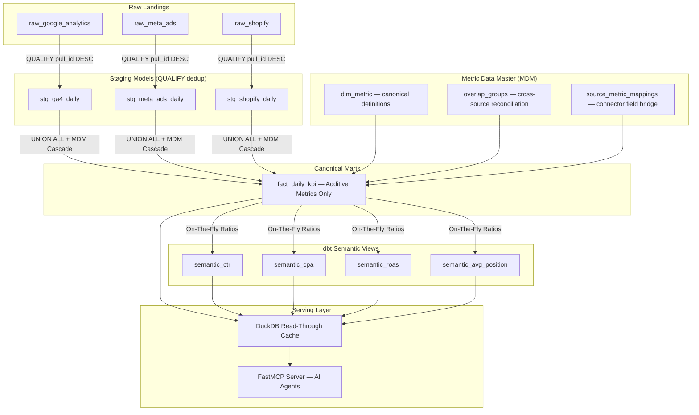

The **Semantic Layer** is toorow's central data modeling boundary. It transforms raw ingestion landings into unified, standardized, governed business indicators available to AI agents and the Admin Console.

The semantic engine has expanded significantly over recent epics — from a basic fact mart to a full **Metric Data Master (MDM)**, multi-source reconciliation, geographic posture governance, and multi-currency harmonization.

---

## Data Lineage & Model Flow

---

## 1. The Data Model (MDM) — Metric Dictionary

The **Data Model** is the canonical interface between raw source fields and the unified semantic metric space. Every connector field is mapped to a canonical target metric through a 3-layer structure:

- **`dim_metric`** — Canonical metric definitions: name, aggregation rule, additive flag, ratio numerator/denominator.
- **`overlap_groups` + `overlap_group_members`** — Multi-source reconciliation topology: which connectors emit the same metric and how their overlap is resolved (`SUM`, `PRIORITY`, `DEDUP_ID`, `KEEP_SEPARATE`).
- **`source_metric_mappings`** — The bridge between a connector's physical field ID and the MDM canonical definition.

### Admin Console: Data Model View

The Data Model screen surfaces the live canonical field registry. Each field shows its:
- **Type**: Metric (blue dot) or Dimension (grey circle)
- **Aggregation Rule** (`sum`, `average`, `count`, `currency`)
- **"Fed by" panel**: Which active datastreams feed this target field via their configured mappings

---

## 2. Multi-Source Reconciliation Engine

When multiple connectors emit the **same metric** (e.g., GA4 and Meta Ads both reporting conversions), the reconciliation engine resolves the overlap according to declared rules:

| Method | Description | Typical Use Case |
|---|---|---|
| `PRIORITY` | Highest-priority connector wins. Falls back to next in priority list. | When one source is authoritative (e.g., GA4 for web conversions). |
| `SUM` | Sum values across all sources. | When sources are additive and non-overlapping. |
| `DEDUP_ID` | Deduplicate based on a shared event ID. | When same events are reported across sources. |
| `KEEP_SEPARATE` | Keep metrics separate per connector, no merge. | Costs (Google Ads spend ≠ Meta Ads spend). |

Resolution is scoped hierarchically: **PROJECT** overrides **ORG** overrides **PLATFORM** defaults. Every mutation writes an append-only audit row in the same transaction.

---

## 3. Geographic Posture & Market Semantics

Markets are defined by **the customer's business scope**, not by language or connector geography defaults. The geographic semantics module (`server/core/geographic_semantics.py`) enforces this:

- **Geographic Posture**: Each project declares a `geographic_posture` — single-market, multi-market, or global.
- **Market Dimensions**: Geography rolls up to `country` (ISO 3166-1) and optionally `market_group` (commercial region clusters).
- **Language is not a dimension**: Language is a content attribute, not a market dimension. Connectors reporting by language are normalized before mart write.

---

## 4. Multi-Currency Harmonization (FX Engine)

All monetary metrics (`spend`, `revenue`, `cost`) are harmonized to the project's declared target currency via the live FX engine (`server/core/money.py`, `server/core/fx_frankfurter.py`):

- **FX at Read** (not at staging): Currency conversion is applied at query time via the Frankfurter FX API rates, avoiding permanent data mutation and enabling retroactive recalculation when the target currency changes.
- **Money-in-Micros**: Monetary values are stored as integer micros internally to avoid floating-point rounding drift. Connectors declare monetary fields in their manifest for adapter-level normalization.
- **Cross-Currency Refusal**: Queries attempting to mix unconverted currencies across sources are refused with a deterministic repair action, not silently summed.

---

## 5. Canonical Daily Fact Surface (`fact_daily_kpi`)

`fact_daily_kpi` is the single canonical additive fact table. All ingestion channels converge here after MDM mapping and geographic/currency harmonization.

### Stored Additive Metrics Only

| Metric | `canonical_target` | Aggregation |
|---|---|---|
| Impressions | `impressions` | `sum` |
| Clicks | `clicks` | `sum` |
| Ad Spend | `spend` | `sum` (harmonized to project currency) |
| Conversions | `conversions` | `sum` |
| Revenue | `revenue` | `sum` (harmonized to project currency) |
| Deployments | `deployments` | `count` |
| Active Users | `active_users` | `sum` |

---

## 6. Non-Additive Ratio Views

Non-additive metrics are **never stored** in `fact_daily_kpi` (AD-4 invariant). They are calculated on-the-fly via dbt semantic views:

| Metric | View | Formula |
|---|---|---|
| **CTR** | `semantic_ctr` | `SUM(clicks) / NULLIF(SUM(impressions), 0)` |
| **CPA** | `semantic_cpa` | `SUM(spend) / NULLIF(SUM(conversions), 0)` |
| **ROAS** | `semantic_roas` | `SUM(revenue) / NULLIF(SUM(spend), 0)` |
| **Avg Position** | `semantic_avg_position` | `SUM(position × impressions) / NULLIF(SUM(impressions), 0)` *(Impression-Weighted)* |

---

## 7. MCP App Widget: Live Semantic Output

The semantic marts directly power the **MCP App GA Widget** — the interactive React UI served to AI agent hosts:

---

## 8. Read-Through Cache (DuckDB)

To deliver low-latency responses to AI agents without incurring BigQuery query costs, toorow includes an optional DuckDB read-through cache:

- **Activation**: `TOOROW_CACHE_ENABLED=true`
- **Ephemeral Snapshot**: Rolling window (default 30 days), strictly scoped per `project_id`.
- **Automatic Rebuild**: After nightly ingestion or on-demand via admin API.

---

## Next Steps & Cross-References

<CardGroup cols={2}>
  <Card title="Data Quality Monitors" icon="shield-check" href="/data-quality">
    Review automated DQ surveillance that guards ingestion into the semantic marts.
  </Card>
  <Card title="Anomaly Detection" icon="chart-line" href="/anomaly-detection-method">
    Explore how semantic marts feed z-score baseline anomaly tracking.
  </Card>
  <Card title="MCP App Use Cases" icon="layer-group" href="/use-cases-library">
    See how AI agents query semantic marts to render interactive UI widgets.
  </Card>
  <Card title="Adding a Connector" icon="plug" href="/adding-a-connector">
    Map new source fields to canonical semantic targets.
  </Card>
</CardGroup>
