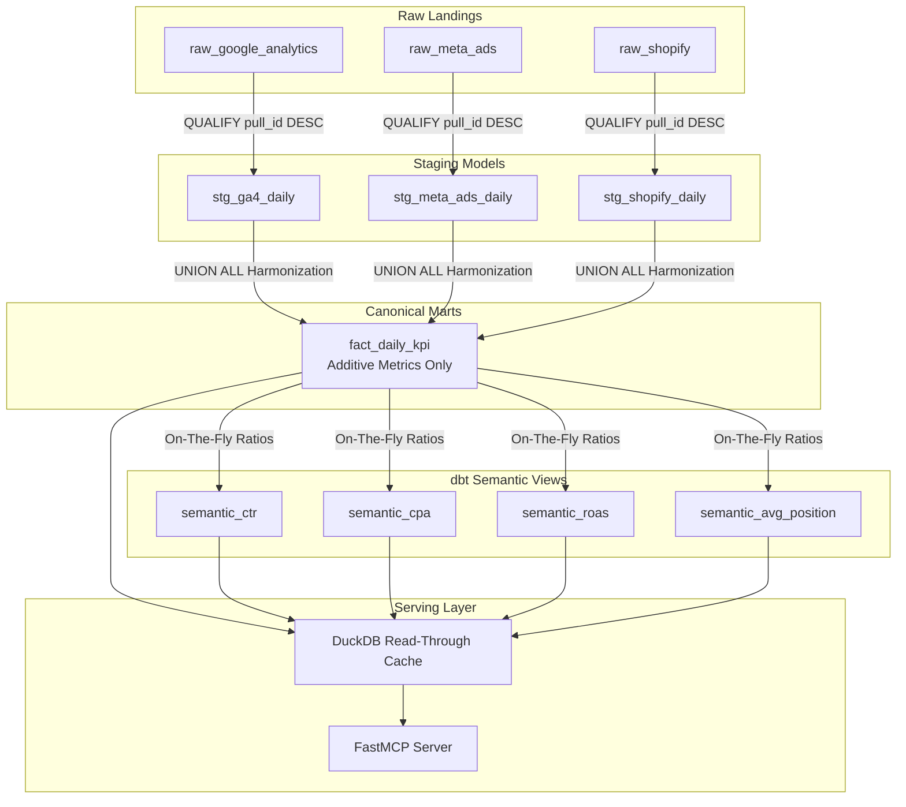

The **Semantic Layer** is toorow's central data modeling boundary. It transforms raw ingestion landings into unified, standardized business indicators available to AI agents and the Admin Console.

---

## Data Lineage & Model Flow

---

## 1. Canonical Daily Fact Surface (`fact_daily_kpi`)

`fact_daily_kpi` is the canonical daily fact table. All additive daily marketing metrics across GA4, Meta Ads, Search Console, TikTok, LinkedIn, Shopify, Stripe, and Mailgun are harmonized into this single model.

### Stored Additive Metrics
Only **additive measures** are stored directly in `fact_daily_kpi`:
- `impressions`: Total ad or search impressions.
- `clicks`: Total click events.
- `spend`: Total advertising cost (harmonized to project currency).
- `conversions`: Total conversion events.
- `revenue`: Total financial revenue.

---

## 2. Non-Additive & Ratio Metrics (dbt Semantic Views)

Non-additive metrics (ratios, percentages, averages) are **never stored** directly in `fact_daily_kpi` (AD-4 invariant). Summing non-additive metrics produces false, misleading figures.

Instead, ratios are calculated on-the-fly via dbt semantic views using exact numerators and denominators:

| Metric | View Name | Calculation Formula |
|---|---|---|
| **CTR** (Click-Through Rate) | `semantic_ctr` | `SUM(clicks) / NULLIF(SUM(impressions), 0)` |
| **CPA** (Cost Per Acquisition) | `semantic_cpa` | `SUM(spend) / NULLIF(SUM(conversions), 0)` |
| **ROAS** (Return on Ad Spend) | `semantic_roas` | `SUM(revenue) / NULLIF(SUM(spend), 0)` |
| **Average Position** | `semantic_avg_position` | `SUM(position * impressions) / NULLIF(SUM(impressions), 0)` *(Impression-Weighted)* |

---

## 3. Read-Through Cache (DuckDB)

To deliver low-latency responses (~50ms) to AI agents without incurring repetitive BigQuery query costs, toorow includes an optional DuckDB read-through cache:

- **Activation**: Enabled via `TOOROW_CACHE_ENABLED=true` in `.env`.
- **Ephemeral Snapshot**: Caches a rolling window of recent marts (default 30 days) filtered strictly by `project_id`.
- **Automatic Rebuild**: Rebuilt automatically following nightly ingestion runs or on-demand via administration APIs.

---

## Next Steps & Cross-References

<CardGroup cols={2}>
  <Card title="Anomaly Detection" icon="chart-line" href="/anomaly-detection-method">
    Explore how semantic marts feed baseline anomaly tracking.
  </Card>
  <Card title="Agentic Daily Insights" icon="sparkles" href="/agentic-daily-insights">
    Learn how AI agents query semantic marts for morning briefings.
  </Card>
  <Card title="Environment Reference" icon="sliders" href="/self-hosting#environment-variable-reference">
    Configure `TOOROW_CACHE_ENABLED` and cache window parameters.
  </Card>
  <Card title="Adding a Connector" icon="plug" href="/adding-a-connector">
    Map new source fields to canonical semantic targets.
  </Card>
</CardGroup>
