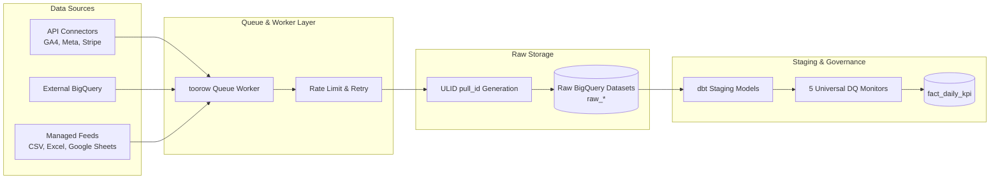

**Universal Datastreams** form the foundational real-data ingestion layer of **toorow**. They provide a single, unified pipeline mechanism for fetching, mapping, scheduling, and publishing marketing data from diverse origins into BigQuery datasets.

---

## Ingestion Pipeline Architecture

---

## 1. Supported Ingestion Sources

toorow unifies three distinct categories of data sources into one governed stream:

| Source Type | Ingestion Pattern | Examples |
|---|---|---|
| **Built-in Connectors** | API pull execution managed by toorow queue worker. | GA4, Meta Ads, TikTok Ads, LinkedIn Ads, Shopify, Stripe, Mailgun. |
| **External BigQuery Objects** | Direct read-only connection to existing warehouse tables or views. | Proprietary data warehouses, pre-ingested analytics tables. |
| **Managed Feeds** | Scheduled ingestion of CSV, Excel, or Google Sheets landed into dedicated raw datasets. | Offline sales feeds, custom target benchmarks, manual promotional budgets. |

---

## 2. Ingestion Guarantees & Lifecycle

### Immutable Execution & Versioning (`pull_id`)
Every ingestion cycle generates a unique, lexically monotonic ULID `pull_id` (AD-7). Pulls are **immutable and append-only**:
- Raw landings store all extracted rows labeled with `pull_id` and `loaded_at`.
- Staging dbt models execute `QUALIFY ROW_NUMBER() OVER (PARTITION BY grain ORDER BY pull_id DESC) = 1`, guaranteeing that the latest pull supersedes previous pulls while preserving full historical auditability.

### Joint Grain Preservation
toorow preserves the full joint grain (metric, date, breakdown dimension, breakdown value) in raw landing datasets. No dimension or breakdown is silently discarded or truncated during ingestion.

### Audited Pipeline Operations
Datastream candidates are published atomically. Administrators and AI agents can invoke distinct audited operations via MCP tools:
- **Synchronize / Backfill**: Fetch historical window dates.
- **Reload / Reprocess**: Re-run staging transformations over raw landings.
- **Replace**: Replace dataset candidate version atomically.
- **Rollback**: Revert to a previous verified candidate version.

---

## Next Steps & Cross-References

<CardGroup cols={2}>
  <Card title="Semantic Layer" icon="layer-group" href="/semantic-layer">
    Learn how datastream facts map into canonical `fact_daily_kpi` marts.
  </Card>
  <Card title="Adding a Connector" icon="plug" href="/adding-a-connector">
    Build a custom connector module for your proprietary data sources.
  </Card>
  <Card title="Self-Hosting Guide" icon="server" href="/self-hosting">
    Configure database URIs and BigQuery datasets for datastreams.
  </Card>
  <Card title="Security & Constraints" icon="shield-check" href="/constraints">
    Review multi-tenant isolation rules governing datastream access.
  </Card>
</CardGroup>
